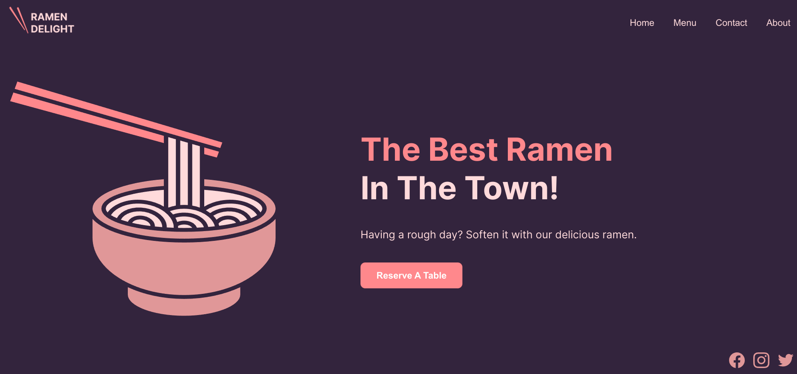

# restaurant-page - [Live Preview](https://porobertdev.github.io/restaurant-page/)

## About

This project is part of [TheOdinProject](https://www.theodinproject.com/) curriculum. The project's lesson can be found [here](https://www.theodinproject.com/lessons/node-path-javascript-restaurant-page). The goal of this project was to practice ES6 Modules and Webpack.

I've made a [Figma mockup](https://www.figma.com/file/1s5G7Xu476yxcagZ44MNJF/restaurant-new?type=design&node-id=0%3A1&mode=design&t=Qu7fHyO09ix8fW5j-1) that I used as a starting point.

## Technologies used

* HTML5
* CSS3
* JavaScript

## NPM modules used

* `css-loader` and `style-loader` to load css
* `html-webpack-plugin` to get the new html into the `dist` directory (production)
* `copy-webpack-plugin` to copy assets to the `dist` directory instead of relying on JS imports or CSS rules

## Tools used

* git
* Figma
* npm
* webpack

## Credits

I changed the original color of some of the icons.

* **Farra Nugraha** for the [ramen bowl](https://thenounproject.com/icon/ramen-in-bowl-6322826/) icon
* **Stephanie Wauters** for the [chopsticks](https://thenounproject.com/icon/chopsticks-10621/) icon
* **vecstock** for the [ramen dish](https://www.freepik.com/free-ai-image/gourmet-ramen-noodles-steaming-bowl-generated-by-ai_41470106.htm#fromView=search&page=1&position=1&uuid=4f94fc79-7cfb-4a8b-9cd5-34c91b7bc186) image
* **freepik** for the [soba noodles](https://www.freepik.com/free-photo/top-view-delicious-noodles-concept_11381864.htm#fromView=search&page=1&position=0&uuid=1926da91-bffb-41c9-a119-22b50c495558) [udon noodles](https://www.freepik.com/free-photo/close-up-view-delicious-ramen-concept_10302627.htm#fromView=search&page=1&position=7&uuid=a11ee2ea-93ab-471b-917c-35dc3d9676b8) images

* **stockking** the [yabisoba](https://www.freepik.com/free-photo/noodles-prepared-with-mushrooms-bell-peppers-sauce_7105053.htm#fromView=search&page=1&position=5&uuid=d2986f6f-5af9-4129-b8fd-330b9084c8d5) image